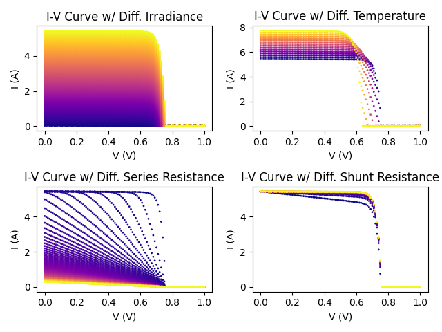
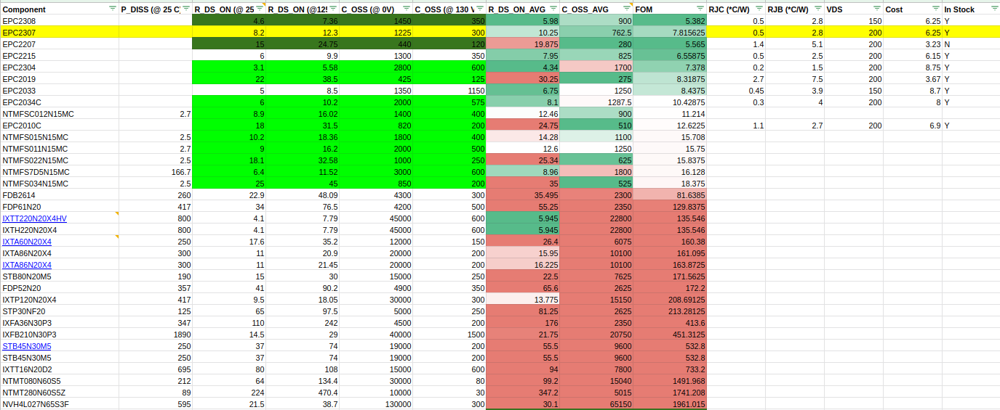
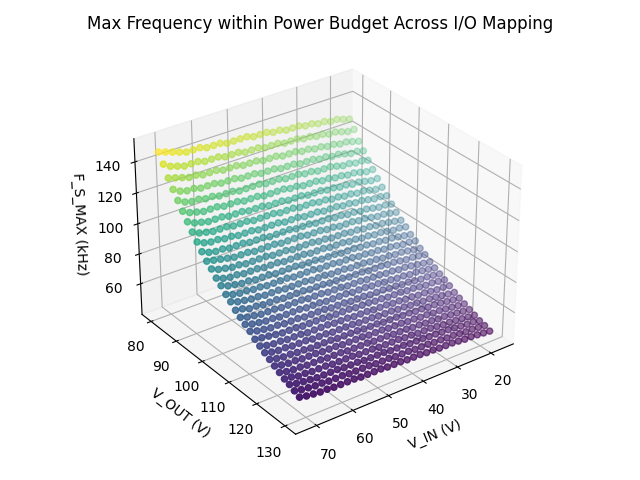

# DESIGN.MD

## PREFACE

This document is meant to show the design process and work and may not be
representative of the HW. Sorry :( I just want to die

## Introduction

We want to design a highly efficient, compact, and useful Maximum Power Point
Tracker (MPPT). This MPPT consists of three main components:

- a DC-DC converter, of which we'll focus the majority of the design process on,
- sensing circuitry, to evaluate the performance and inform the control of the
  converter,
- and a microcontroller, which will run the attendant MPPT algorithms and
  maximize the overall power transfer.

---

## Input

We define the input of the MPPT to be a solar array, consisting of a large
number of photovoltaic cells strung in series with bypass diodes across each
cluster of cells. This solar array, in the optimal conditions (STC - $25 \,
C, 1000 \, \frac{W}{m^2}$),
shall have the following characteristics:

| Property           | Value  | Units |
|--------------------|--------|-------|
| Cell Specific      |        |       |
| $V_{OC}$           | 0.721  | V     |
| $I_{SC}$           | 6.15   | A     |
| $V_{MPP}$          | 0.621  | V     |
| $I_{MPP}$          | 5.84   | A     |
| $P_{MPP}$          | 3.63   | W     |
| Array Specific     |        |       |
| $N_{CELLS}$        | 111    |       |
| $V_{OC}$           | 80.031 | V     |
| $I_{SC}$           | 6.15   | A     |
| $V_{MPP}$          | 68.931 | V     |
| $I_{MPP}$          | 5.84   | A     |
| $P_{MPP}$          | 402.56 | W     |

A specification of the cell characteristics and the model output used for this
project is shown below.

---

## Output

We define the output of the MPPT to be a LiMnNi battery pack, with a voltage
range of $V_{BATT} \in [80, 134.4] \, V$.

---

## Design Requirements

We define the following requirements based off the design.

- All components of the system shall be rated for $125 \, C$.
- All components of the system shall have a safety factor of $\times 1.25$.

---

## Design Inputs

We define the following design inputs, and reserve the right to modify them as
expressed in the design methodology flowchart to optimize performance.

- Given that maximum power transfer will be $400 \, W$, the MPPT shall have
  a maximum instantaneous power transfer efficiency of $98.5 \, \%$. This means
  that the maximum power dissipation must be no more than $6 \, W$ across the
  following components:
  - MOSFET switches
  - Capacitors
  - Inductor
- We will attempt to prefer the optimization of switching loop area (and thus
  parasitics) over the thermal effects of the switches. As such, we attempt to
  allocate only $20 \, \%$ of the power budget ($1.2 \, W$) per switch and the rest
  of the budget to be allocated for the passives.
- We shall operate in the following regimes:
  - $V_{IN} \in [17.23, 71.7] \, V$
    - The lower bound retains the top $75 \, \% \, V_{IN}$ candidates
      less than $V_{MPP}$.
    - The upper bound retains the top $25 \, \% \, V_{IN}$ candidates
      greater than $V_{MPP}$.
    - These bounds were chosen to reduce switch stress and retain the majority
      of the input voltage that can generate significant power. In this case,
      the cutoffs were slightly above $100 \, W$.
  - $V_{OUT} \in [80, 130] \, V$
    - We leave a margin of error between $130$ and $134 \, V$ to accomodate
      up to $4 \, V$ of output ripple.
- The MPPT shall have a minimum input control resolution of $0.725 \, V$, or
  $1 \, \%$ of the $V_{OC}$. This allows for smaller steady state oscillations due to:
  - Converter input capacitance ripple
  - MPPT algorithm steady state response
- The MPPT shall have an minimum input response rate of $\frac{80 \, V}{sec}$. A faster
  response rate means that the MPPT algorithm can converge more quickly.
- The MPPT shall have a maximum inductor current ripple of $1.23 \, A$, or
  $20 \, \%$ of $I_{SC}$. $20 \, \%$ is relatively standard ripple ratio.
- The MPPT shall have a maximum output voltage ripple of $1 \, V$, or at most
  $0.385 \, \%$ of $V_{BATT}$. This means that the output voltage of the MPPT must be
  at least $1 \, V$ above $V_{BATT}$ for constant power flow.

---

## Methodology

The following discussion of methodology is a practical example can be
generalized by the design methodology flowchart. It may not be indicative of the
final design.

1. The first step is to review the existing requirements and design inputs and
   understand how they affect the design of the converter and how they might
   impact the system, including:
   - switching frequency
   - power loss
   - thermal dissipation
   - sizing
   - EMI

   We understand that a higher operating efficiency generally means that we
   need:

   - a pair of switches with a smaller FOM.
     The FOM ratio ($R_{DS,ON}$ vs $C_{OSS}$) determines the loss attributable to
     switching losses vs conduction losses. A higher $R_{DS,ON}$ raises the lower
     bound conduction loss (y-intercept), while a higher $C_{OSS}$ limits the
     maximum switching frequency through the rate of change of frequency vs
     power diss. (slope).

     $$
     FOM = R_{DS,ON} \times C_{OSS}
     $$

   - a lower switching frequency.

     A lower switching frequency will create smaller switching losses, but will:

     1. require larger input/output capacitance and inductance.
        This makes them also physically larger.
     2. make parasitics (i.e. see below) better or worse, depending on which
        dominates:

        - worse L, C, or
        - better dT (due to lower switching speed)

        $$
        v = L \times \frac{dI}{dT} \\
        and\\
        i = C \times \frac{dV}{dT}
        $$

   - smaller thermal footprint, particularly for the switches. This can make
     the overall space dedicated for thermal smaller, and result in tighter
     switching nodes, which can improve parasitics.

   We understand that looser requirements on voltage and current ripple can
   reduce the required capacitance and inductance, respectively. This can result
   in smaller components, but may incur higher loss penalty.

2. The second step is to determine the switch requirements. This is
   $V_{DS,MIN}$, $I_{D,MIN}$, and $P_{D,MIN}$.

    $$
    V_{DS,MIN} = V_{OUT,MAX} \times SF \\
    I_{D,MIN}  = I_{IN,MAX}  \times SF \\
    P_{D,MIN}  = V_{IN,MPP}  \times I_{IN,MPP} \times (1 - EFF) \times SF \times SW\_DIST
    $$

    For our input, we looked for switches that met the following values:
    - $V_{DS,MIN} = 162.500 \, V$
    - $I_{D,MIN}  = 7.688   \, A$
    - $P_{D,MIN}  = 2.264   \, W$

    We also specified that the switches had a minimum operating temperature of
    $125 \, C$.

3. After determining the switch requirements, we ran a parametric search for
   switches, optimizing for the following qualities:
   - low $R_{DS,ON}$
   - low $C_{OSS}$
   - low $FOM$
   - good thermal conductivity
   - small footprint

   We calculated $R_{DS,ON}$ and $C_{OSS}$ as an average of the best and worst
   cases. For $C_{OSS}$, we looked at the average of $C_{OSS}$ at $0 \, V$ and $130 \, V$
   ($V_{OUT,MAX}$). For $R_{DS,ON}$ we looked at the average of $R_{DS,ON}$ at
   $25 \, C$ and $125 \, C$.

   This search was performed for several manufacturers, and after about a
   hundred switches we narrowed down the list to a set of fifteen candidate
   switches.

   

4. From these fifteen candidate switches, we determined the top $25 \, %$ quartile of
   switches by $FOM$ and took the median $FOM$ (which is the value of the $12.5 \, \%$
   percentile). Ideally, the switches at this $FOM$ has a broad ratio of
   $R_{DS,ON}$ to $C_{OSS}$.

   From our list, this is $6.31 \, ps$.

5. We generated a 2-D Matplotlib mapping of the maximum switching frequency
   $F_{SW,MAX}$ for a given $R_{DS,ON}$ to $C_{OSS}$ ratio. We can see that for
   a chosen FOM of $6.31 \, ps$, the limiting operating condition is at
   $V_{I,MIN}, V_{O,MAX}$. The maximum possible frequency at this power budget
   and inductor ripple is at about $10 \, m\Omega$, which corresponds to $630 \,
   pF$.

   

   **TODO: Image for Power equations (switching, conduction).**

6. From this initial analysis, we can choose a switch. In particular we took the
   **EPC2307**, a GaN enhancement mode power transistor. This FET has a $FOM$ of
   $7.816 \, ps$ and an $R_{DS,ON}$ of $10.25 \, m\Omega$. The $FOM$ is slightly higher than
   the median, but sports a superior temperature coefficient of $R_{JC}$ of $0.5
   \frac{C}{W}$ and $R_{JB}$ of $2.8 \frac{C}{W}$.

7. We re-generate a full $F_{SW,MAX}$ surface map across all $V_I$, $V_O$ combos, and look
   for the minimum $F_{SW,MAX}$. This will be our switching frequency and is $46
   kHz$.

   

8. At the same time as selecting the $F_{SW}$, we perform an initial thermal calculation.

    **TODO: put in thermal sizing notes and work.**

9.  After determining the switching frequency $F_{SW}$, we can determine the
   capacitor requirements. This is:
   - $C_{I,MIN}$
   - $V_{DC,I,MIN}$
   - $C_{O,MIN}$
   - $V_{DC,O,MIN}$

   **TODO: Image for input and output capacitance equations.**

    For our input, we looked for switches that met the following values:
    - $C_{I,MIN}    = 4.131  \, uF$
    - $V_{DC,I,MIN} = 90.539 \, V$
    - $C_{O,MIN}    = 54.282 \, uF$
    - $V_{DC,O,MIN} = 163.75 \, V$

    We also specified that the switches had a minimum operating temperature of
    $125 \, C$.

10. We run a parametric search for capacitors, and optimize for low ESR and
    size. For each of these capacitors, we also check the required minimum
    ripple current $I_{RMS}$.

    $$
    V_{RMS} = \frac{V_{PP}}{(2 \times \sqrt{3})} \, V \\
    I_{RMS} = \frac{V_{RMS}}{ESR} \, A
    $$

    For the input capacitor, $V_{PP}$ is $0.75 \, V$, and for the output capacitor,
    $V_{PP}$ is $1.25 \, V$. This translates to a $V_{RMS}$ of $0.217\, V$ and
    $0.361\, V$, respectively.

11. We chose the **RA4505K100** film capacitor. It has the following properties:
    - $V_{DC,I} = 100 \, V$
    - $C_{I} = 5 \, uF$
    - $DF = 1 \, \%$
    - $11.4 \, mm \times 5.6 \, mm \times 12.2 \, mm$ (L/W/H)

    From the dissipation factor $DF$, we can derive the ESR as follows.

    $$
    ESR = DF \times X_C \\
    ESR = \frac{DF}{2 \pi F_{SW} C} \\
    ESR = \frac{0.01}{2 \times 3.14 \times 46 \, kHz \times 5 \, uF} = 6.9 \, m\Omega
    $$

    Since the source is a current source that supplies most if not all the
    current, we do not worry about the rated ripple current rating of our input
    capacitor. However, we note that the device has a rated current of $8 - 9 \, A$
    at our frequency which is well more than our maximum input current.

12. We chose the output capacitor to be three **A759MS186M2CAAE090** aluminum
    organic polymer capacitors in parallel. Each capacitor has the following
    properties:
    - $V_{DC,O} = 160 \, V$
    - $C_{O} = 18 \, uF$
    - $ESR = 90 \, m\Omega \, @ \, 100 \, kHz$
      - We predict ESR to be slightly higher, at $120 \, m\Omega$, at $47 \, kHz$.
    - $I_{RMS} = 1.944 \, A$
    - $10 \, mm \times 12 \, mm$ (D/H)

    In parallel, the simplified equivalent $ESR$ is $40 \, m\Omega$ and equivalent
    simplified capacitance is $54 \, uF$.

    **TODO: I suspect this calculation isn't correct, since ESR should be
    evaluated from parallel impedances. This goes down to 40 mOhm which means
    current required overall goes up.**

13. We can now derive the power loss from both capacitors.
    - $P_{D,I}$ = $F_{SW} \times C_{I} \times V_{RMS,I}^2 \times ESR$
      - $= 46 \, kHz \times 5\, uF \times 0.217 \, V$
      - $= 50 \, mW$
    - $P_{D,O}$ = $F_{SW} \times C_{O} \times V_{RMS,O}^2 \times ESR$
      - $= 46 \, kHz \times 54 \, uF \times 0.361 \, V$
      - $= 89.7 \, mW$

    Power wise, we can now reallocate the more towards the inductor. The
    magnitude of losses is in line with Ehlan et al. (Evaluation of Power Losses
    in a DC-DC Boost Converter).

14. The next step is to determine inductor requirements.

    **TODO: put in inductor sizing notes and work.**