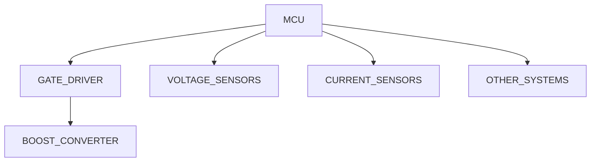
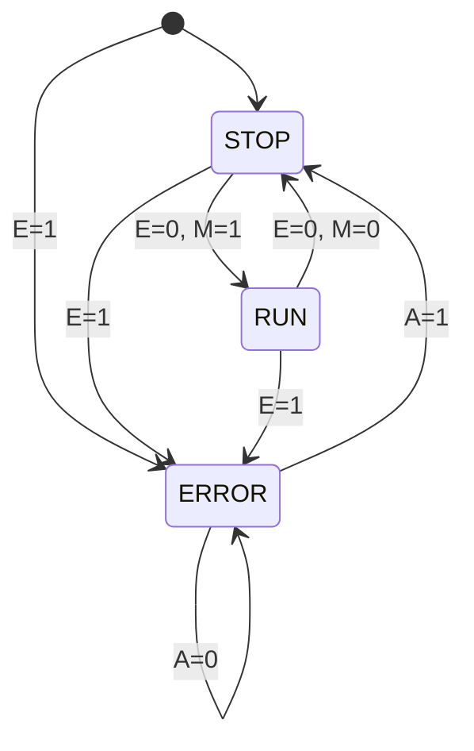

# SUNSCATTER GEN 2 SYSTEM DESIGN

This document describes the current operating structure and system design of the
Sunscatter Gen II PCB. It defines the tasks that should be run, the inputs and outputs
of the device, and the necessary communication protocols to interface with other
systems. 

---

## System design



The systems consists of a STM32 L432KC low power microcontroller sampling two
pairs of voltage and current sensors at the Array input and Battery output. It
gathers this data, processes it, and adjusts the PWM signal that drives a gate
driver and controls the DC-DC Boost Converter. It also broadcasts and
communicates sensor data to subscribed (pub-sub) participants.

---

## Program execution

This device runs on a HLFSM, in which there are three states, **STOP**, **RUN**,
and **ERROR**. Transition between these states depend on error occurrence and
the latest SET_MODE and ACK_FAULT CAN messages, described further in
section [Communication](#communication). 


Program execution:
 - **1 Hz** cycle of HEARTBEAT LED to indicate liveliness
 - Messages for the Sunscatter are captured and interpreted asynchronously.
 - Voltage and Current sensors are measured at a fixed internal rate and
   broadcasted to other boards via CAN at a known external rate.
   - Default **1 Hz** external rate.
   - Default **1 Hz** internal rate, dependent on 0x608.

STOP mode:
 - Measurements are active. 

RUN mode:
 - When in the RUN mode, TRACKING LED is ON.
 - Internal MPPT algorithm controller is tracking for optimal power conversion.

ERROR mode:
 - When in the ERROR mode, ERROR LED is ON.
 - The internal MPPT algorithm controller is disabled and PWM_EN is off.
   Converter is open circuit.

```
IS_ERROR = E
SET_MODE = M
ACK_FAULT = A
```



The overall system runs on an event queue; events are scheduled in this queue and
run on demand. We have several event generators:
- querying voltage and current sensors,
- running the MPPT algorithm controller,
- changing state machine state,
- processing CAN messages.

> EG stands for event generator.

TODO: add sequence diagram; see Blackbody A.

---

## Communication

Sunscatter Version 0.2.0 is meant to be for three separate subarrays on the 2024
Solar Vehicle. As such, each Sunscatter is delineated by the second nibble in
the CAN ID as follows:

- Sunscatter A: 0x60X
- Sunscatter B: 0x61X
- Sunscatter C: 0x62X

CAN messages:

| ADDRESS | NAME     | DIRECTION | NUM BYTES | DESCRIPTION                                                  |
|---------|----------|-----------|-----------|--------------------------------------------------------------|
| 0x6X0   | HEARTBEAT| OUT       | 1         | Seconds/heartbeat cycles since startup.                      |
| 0x6X1   | SET_MODE | IN        | 1         | 0x00 -> STOP, 0x01 -> RUN. BOARD OVERRIDE EN/DIS             |
| 0x6X2   | SS_FAULT | OUT       | 2         | Error code, see [ERRORS](#errors)                            |
| 0x6X3   | ACK_FAULT| IN        | 1         | 0x01 -> Ack fault and return to STOP state                   |
| 0x6X4   | SEN_CONF1| IN        | 5         | MSB: enabled sensors; LSB(3): Sensor filter type. LSB(2): Sensor filter length, in samples. LSB(0-1): Sensor sampling freq, in Hz. |
| 0x6X5   | SEN_CONF2| IN        | 5         | MSB: enabled RTDs; LSB(4): Sensor slope correction, float   |
| 0x6X6   | SEN_CONF3| IN        | 5         | MSB: enabled RTDs; LSB(2): Sensor Y-int correction, V/A     |
| 0x6X7   | CON_CONF | IN        | N/A       | Controller configuration. RESERVED. Not yet Defined.        |
| 0x6X8   | DEB_CONF | IN        | 1         | Debug configure. See notes. Level of CAN debug output             |
| 0x6X9   | OP_SET   | OUT       | 8         | MSW: Freq. Setpoint in Hz, float; LSW: Duty cycle Setpoint, float |
| 0x6XA   | ARRV_MEA | OUT       | 4         | Voltage in Volts, float                                      |
| 0x6XB   | ARRI_MEA | OUT       | 4         | Current in Amps, float                                       |
| 0x6XC   | BATTV_MEA| OUT       | 4         | Voltage in volts, float                                      |
| 0x6XD   | BATTI_MEA| OUT       | 4         | Current in Amps, float                                       |


> If a fault has occured, then the controller must acknowledge the fault
(ACK_FAULT=1) and then restart sampling by setting the mode to RUN (SET_MODE=1). 
> BPS shall use SET_MODE as the BOARD_OVERRIDE ENABLE/DISABLE command. This is highest priority signal. 
> **NOTE** Default filter is median filter with 10 wide window. No current support for dynamic filter generation. LEAVE SEN_CONF1 UNUSED.
> **NOTE** CON_CONF is not implemented, LEAVE UNUSED.

> The MSB of SEN_CONF1, SEN_CONF2, and SEN_CONF3 is a bit packed struct indicating which sensors are selected; e.g. for SEN_CONF1 MSB:
>
> `0bxxxx_0001`
>
> Battery current sensor selected. The ordering is left to right matching with top to bottom on the table.

---

## ERRORS

| NUMBER | DESCRIPTION                    |
|--------|--------------------------------|
| 000    | No fault.                      |
| 100    | Input undervoltage lockout     |
| 101    | Input overvoltage lockout      |
| 102    | Input undercurrent lockout     |
| 103    | Input overcurrent lockout      |
| 104    | Output undervoltage lockout    |
| 105    | Output overvoltage lockout     |
| 106    | Output undercurrent lockout    |
| 107    | Output overcurrent lockout     |
| 108    | Input/Output voltage inversion |
| 109    | PWM under duty cycle lockout   |
| 110    | PWM over duty cycle lockout    |
